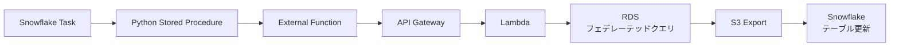

こんにちは、クラシルリワードでデータエンジニアをしているharry([@gappy50](https://x.com/gappy50))です。

最近、私たちのチームでDevin Playbookを使ったデータパイプライン自動化に取り組んでいます。具体的には、RDSテーブルからSnowflakeへのデータパイプライン構築を、**自然言語での指示だけで完全自動化**できるようになりました。

これまでは新しいテーブルを追加する際、エンジニアが複数のリポジトリを手作業で設定する必要があり、1テーブルあたり半日から1日の工数がかかっていました。しかし今では「○○テーブルをデータパイプラインに追加してください」という一言で、AIが自動的にすべての設定を行ってくれます。

本記事では、どのようにしてこの自動化を実現したのか、そして体験を通じて学んだ「DataOpsとAIの真の相乗効果」について詳しくお話しします。

## 我々のRDSデータパイプライン方式と課題

クラシルリワードでは、新機能開発が非常に活発です。新しい機能がリリースされるたびに、その機能で使用するRDSテーブルのデータをSnowflakeのデータ基盤に取り込む必要があります。

当初は「新しいテーブルをデータ基盤に追加してください」という依頼が来るたびに、エンジニアが手作業で設定を行っていました。1テーブルあたり半日から1日の作業時間がかかり、テーブル数が増えるほど運用負荷が高まっていく状況でした。

この課題を解決するため、私たちは効率的なデータパイプラインアーキテクチャの構築に取り組みました。一般的には、RDSからS3にExportしてSnowflakeに取り込むパターンが多いと思いますが、私たちはフェデレーテッドクエリを使ったアプローチを採用しています。

### フェデレーテッドクエリアーキテクチャ

この方式の**メリット:**
- **スキーマ自動検出**: RDSのカラム追加やデータ型変更を手動設定なしで自動反映
- **統一されたクエリインターフェース**: SnowflakeからSQL一本でRDSにアクセス可能。複数のデータソースを意識する必要がない
- **設定の簡素化**: 従来のETLパイプラインで必要だった複雑なデータ変換処理やスケジューリング設定が不要
- **柔軟な更新方式**: テーブルの特性に応じて全件取得も増分更新も選択可能。運用開始後の変更も容易

さらに、Terraformモジュール化により技術的な複雑性を隠蔽しました。114個のテーブルが統一されたパターンで管理され、新しいテーブル追加時は**テーブル名を指定するだけ**で実装が完了するようになりました。

### モジュール化後も残った運用課題

技術的な実装工数は大幅に削減できましたが、**オペレーション上の課題**が残っていました。

新しいテーブルを追加する際の従来フロー:
1. **依頼受付**: ビジネスサイドからの追加依頼
2. **エンジニア実装**: 3つのリポジトリ（アプリケーション基盤、データ基盤(Snowflake)のIaC、dbtリポジトリ）での手作業設定
3. **テスト・デプロイ**: 各環境での動作確認

各テーブルには5つのSnowflakeタスクが自動生成されますが、それでも以下の課題が残りました：
- **依頼ベースの対応**: データエンジニアへの毎回依頼が必要
- **属人化リスク**: 手順を理解しているエンジニアが限定的
- **実装時間**: 半日〜1日/テーブルの作業時間
- **スケーラビリティ**: 114個のテーブル管理の運用負荷

この「依頼→エンジニア実装→デプロイ」のサイクルは、技術的複雑さは解決したものの、オペレーション上のボトルネックは残ったままでした。

## AIの力：Devin Playbookによる解決

そんな状況で登場したのが **Devin Playbook** です。

Devin PlaybookはコーディングAIの機能の一つで、複数のステップを組み合わせた作業を自然言語で指示するだけで、AIが自動的に実行してくれます。

この技術により、これまでデータエンジニアに依頼する必要があった作業を、オーナーシップを持った担当者が自然言語での指示だけで直接実行できるようになりました。

実際に、自然言語の指示だけで以下のように「3つのリポジトリ（アプリケーション基盤、データ基盤IaC、dbt）での設定作業」が完全自動化され、誰でも新しいテーブルのデータパイプライン追加を依頼できるようになりました。

### 今回作成したPlaybookが達成すること

「RDSテーブルをデータ基盤にSyncするPlaybook」は、3つの段階を経てデータパイプラインを完全構築します。

まず**ステップ1**では、RDSテーブルがSnowflakeからアクセス可能になるよう接続設定を行います。これにより、Snowflake側からRDSのデータを直接参照できる基盤が整います。

次に**ステップ2**で、データパイプラインタスクを自動生成し、定期実行される仕組みを構築します。これまで手動で設定していた複雑なタスク設定が、テーブル名を指定するだけで自動的に適切な形で生成されます。

最後の**ステップ3**が最も高度な処理で、dbtでデータ変換可能な統一されたstagingモデルを作成します。ここでAIは単純なファイル生成を超えた作業を行います。

**AIによるビジネスメタデータの自動生成**

特に注目すべきは、AIがアプリケーションの設計書全体を走査して、テーブルやカラムの**ビジネス的な意味**を理解し、適切なメタデータを自動生成することです。従来のコード生成ツールは技術的な情報のみを扱いますが、このPlaybookではAIがアプリケーションのドメイン知識を理解し、「このテーブルはユーザー情報を管理する」「このカラムは課金に関わる重要な情報」といったビジネスコンテキストを含むドキュメントを生成します。

この結果、「userテーブルを追加して」という一言で、新しいテーブルが既存の114個のテーブルと同じ品質・形式でデータ基盤に統合され、即座に分析・活用可能な状態になります。エンジニアが半日かけて行っていた作業が、数分で完了し、しかも人間が作成したものと同等のクオリティが担保されるのです。

### Playbookの真の価値：AIによる高度なコンテキスト理解

これまでDataOpsで整備してきた基盤があったからこそ、AIがここまで効果的に動作したのかなと思っています。

特に注目すべきは、AIがサーバーサイド側の設計やビジネスの文脈を理解して、dbtのYAMLにビジネスメタデータを埋め込めることです。単純な設定ファイルの追記だけでなく、データの意味や用途を理解した上で適切なメタデータを生成できるのは、今まで以上に効果的な対応だと思っています。

## AI時代のDataOpsの重要性

AI-Readyなデータ活用というと、多くの場合エンドユーザーの活用をイメージすることが多いと思います。Text2SQLやダッシュボード生成、分析レポートの自動化など、データを「使う」側面でのAI導入が注目されがちです。

しかし、エンドユーザーがどれだけ効果的にAIでデータ活用できるかは、実はDataOpsをどれだけ効率的に運用できるかにかかっているのではないでしょうか。データの収集、変換、品質管理、配信といったデータライフサイクル全体の運用品質が、結果的にエンドユーザーの体験を左右します。

今回の事例も、基盤運用の自動化が実現されたからこそ、より質の高いデータをより迅速にエンドユーザーに提供できるようになりました。

### DataOpsがAI活用の鍵である理由

今回の事例から見えてきたのは、AIの活用成功の鍵は、その前段階のDataOps基盤にあるということです。

AIに親和性が高いDataOpsの特徴：
- **パターン化された処理**: AIが学習・再現しやすい統一された手順
- **明確なドキュメンテーション**: 文脈を理解しやすい構造化された情報
- **標準化されたアーキテクチャ**: 一貫した判断基準と実装パターン
- **品質管理の仕組み**: 自動検証による信頼性の担保

単発のText2SQLと、体系化されたDataOps + AIでは、その効果に大きな差が生まれます。DataOpsで整備された基盤があってこそ、AIは真の力を発揮できるのだと思います。

## まとめ：これまでのゴールの延長線

今回の体験を振り返ると、AIが実現したのは「分析のためのAI」を支えるDataOpsをどれだけ高速に回せるか、という課題の解決でした。

実は、これは私がこれまで重要だと考えてきた「データエンジニアリングの民主化」の延長線上にあるものだと思います。

私は以前から、データエンジニアリングをより多くの人が取り組めるものにすることが重要だと考えていました。なぜなら、データから意思決定をする人が、自分たちの意思決定のためのデータにもオーナーシップを持つのが理想だからです。データエンジニアがすべての意思決定にオーナーシップを持つことは現実的に不可能であり、意思決定者自身がデータエンジニアリングに取り組めるようになることで、この課題を解決できます。

[「データライフサイクルを爆速で回せるデータ基盤」](https://zenn.dev/dely_jp/articles/2c1d3c42f3bbf6)で書いたように、非エンジニアでもデータモデルを作成でき、アドホック分析から定型分析への移行がスムーズに行え、データガバナンスと柔軟性のバランスが取れた環境を目指してきました。

https://zenn.dev/dely_jp/articles/2c1d3c42f3bbf6

今回のDevin Playbookによる自動化は、この「民主化」というゴールをAIの力で実現していく一つの形なのかもしれません。データエンジニアリングの本質的なゴールは変わらず、それをどれだけAIの力で多くの人が取り組めるようにできるかが重要なのだと思います。

同じような課題を抱えている方の参考になれば嬉しいです。

パワー！

---

**追伸**: この記事は[Claude Code](https://claude.ai/code)を使用して執筆しました。事前にharryの過去記事を分析して文体の特徴を`.claude/CLAUDE.md`にまとめ、それをもとにharryらしい文体での執筆を実現しています。AIが単なるツールではなく、個人の文体や価値観を理解したライティングパートナーとして機能することを実感する体験でした。